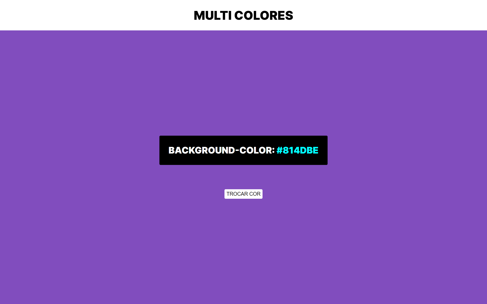

# COLOR FLIP RANDOM

#

 Primeiro dia do projeto <b>TODO DIA COM JS</b>
   
 No projeto de hoje fiz um site onde consigo mudar 
 a cor de fundo de forma aleatoria, e ao mudar ele exibe 
 o codigo dela em hexadecimal.

#

 

  TECNOLOGIAS
   

   
