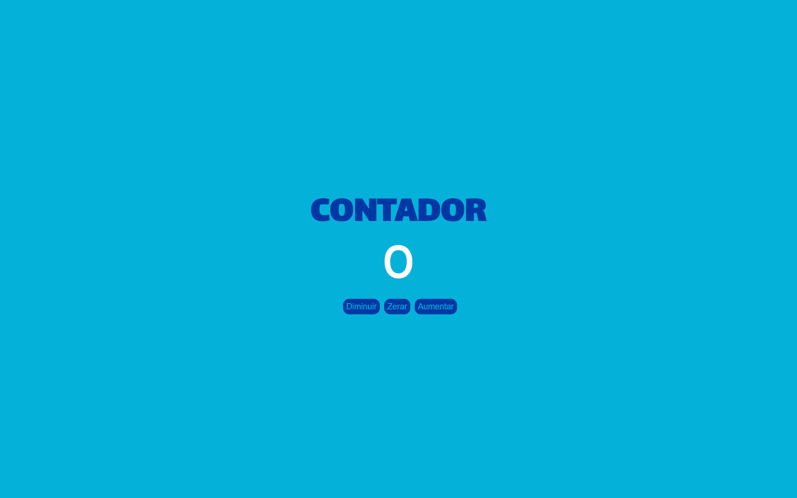

# CONTADOR

#

 Segundo dia do projeto <b>TODO DIA COM JS</b>
   
 No projeto de hoje fiz um contador com três botões, 
 de diminuir, zerar e aumentar, decidir arriscar com 
 algumas cores, mas design ainda não é meu forte.

#

 

  TECNOLOGIAS USADAS
   

   
